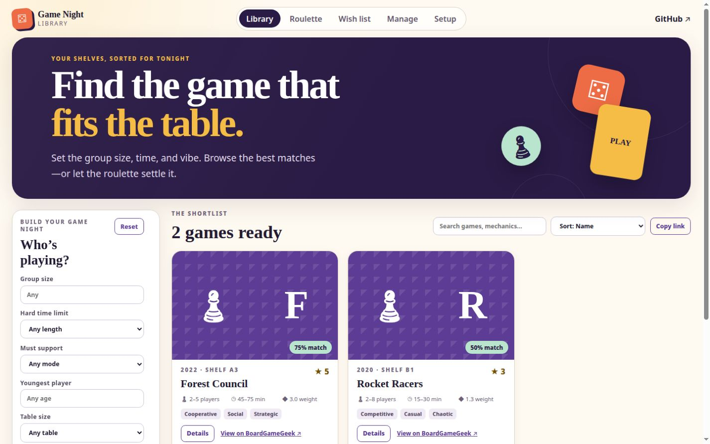

# Game Night Library

A public, phone-friendly board game inventory for finding what fits the group. Filter by player
count, time, play style, accessibility needs, and house preferences—or let the weighted roulette
make the final choice.

[Open the library](https://bahbus.github.io/BoardGameInventory/) ·
[Read the documentation](docs/README.md) ·
[Contribute](CONTRIBUTING.md)



_Example catalog data shown._

## What it does

- Keeps owned games and expansions in a portable, reviewable YAML inventory.
- Enriches the catalog with BoardGameGeek metadata during trusted GitHub Actions builds.
- Applies hard group requirements first, then ranks eligible games against softer preferences.
- Provides shareable filters and a transparent weighted roulette with no tracking or accounts.
- Keeps unowned games in a separate wish list so they never enter filters or roulette early.
- Turns guided Setup and maintenance requests into pull requests that a maintainer reviews manually.

The public site is static and hosted by GitHub Pages. Filtering, scoring, and roulette happen in
the browser; no personal profiles or named-player data are stored.

## Documentation

| Guide                                                        | Best for                                                          |
| ------------------------------------------------------------ | ----------------------------------------------------------------- |
| [Using the library](docs/USING_THE_LIBRARY.md)               | Visitors choosing a game or making a request                      |
| [Initial collection setup](docs/INITIAL_COLLECTION_SETUP.md) | Owners importing and reviewing a collection                       |
| [Maintaining the library](docs/MAINTAINING_THE_LIBRARY.md)   | Collaborators adding, editing, removing, or wish-listing games    |
| [Development](docs/DEVELOPMENT.md)                           | Contributors running and testing the project locally              |
| [Architecture](docs/ARCHITECTURE.md)                         | Maintainers understanding data flow and trust boundaries          |
| [Setup service](docs/SETUP_SERVICE.md)                       | Administrators deploying collaborator verification and submission |
| [Repository policy](docs/REPOSITORY_POLICY.md)               | Administrators auditing GitHub protections and security settings  |

The [documentation index](docs/README.md) groups these pages by audience and workflow.

## Quick local start

Requires Node.js 24 LTS.

```sh
npm install
npm run dev
```

An empty inventory builds without credentials. See [Development](docs/DEVELOPMENT.md) for
environment variables, validation commands, generated files, and deployment behavior.

## Data and licensing

Inventory and shelf labels are public; never enter addresses, access instructions, contact details,
or other private information. Application code is MIT licensed. BoardGameGeek data, images, names,
and logos remain subject to their respective owners and terms; see [NOTICE.md](NOTICE.md).
