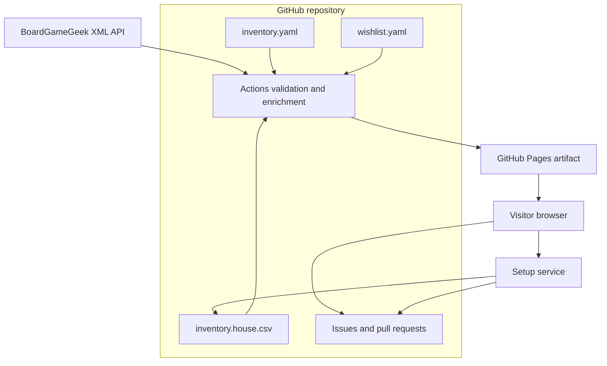

# Architecture

Game Night Library uses GitHub as the durable data and review system while keeping the public
application static. The only independent backend is the narrow Setup verification and submission
service.

## System overview

## Authored and generated data

`data/inventory.yaml` is the ownership authority. `data/wishlist.yaml` is deliberately separate so
unowned games cannot enter group filters or roulette. Initial matching and house CSV files preserve
review decisions that cannot be reconstructed safely from BGG.

During a trusted build, authored data is combined with BGG title, year, player ranges and polls,
duration, age, complexity, categories, mechanics, rating, rank, images, URL, and refresh time. The
generated catalog and cached thumbnails exist only in the Pages artifact.

House overrides are explicit. The application displays both general BGG values and local values and
identifies which one controls eligibility. Game modes and match scores are application inferences,
not BGG-supplied facts.

## Browser responsibilities

The Preact application performs these operations locally:

- parse and serialize versioned shareable preferences;
- apply hard requirements;
- calculate normalized soft-preference match scores;
- sort and search eligible games;
- select roulette results with `crypto.getRandomValues`;
- store the latest unnamed settings and roulette exclusions in browser storage.

The browser never receives the BGG API token, GitHub App private key, client secret, installation
token, or service signing key. It does not directly write repository contents.

## Code ownership boundaries

Reusable data contracts live under `shared`. `shared/inventory` owns the canonical inventory and
wish-list types and validation. `shared/catalog` owns generated BGG and catalog payload types.
`shared/setup` owns questionnaire rows and CSV serialization, guided-answer options and inference,
and deployed-revision validation. The browser, setup service, and build scripts may depend on these
domains, but shared code has no dependency on those consumers. Generic CSV parsing lives alongside
them.

Browser presentation remains under `src`, runtime HTTP and GitHub integration remain under
`service`, and repository-maintenance commands remain under `scripts`. Script-only preparation,
such as creating the initial house questionnaire from the matching manifest, stays in `scripts`
while reusing shared contracts. Browser compatibility modules may re-export shared types and
parsers, but repository scripts import their owning shared domain directly rather than depending on
the browser tree.

Feature-owned browser presentation lives under `src/features`. The collaborator-only Setup route
owns its questionnaire components and responsive styles there and is loaded as a separate browser
chunk only when Setup is opened. Public catalog visitors therefore do not download the private
questionnaire interface or its styles.

## Mutation boundaries

Routine inventory and wish-list maintenance begins with a prefilled GitHub issue. Approved
automation applies exactly one validated transaction to the corresponding canonical YAML file on a
branch and opens a pull request. It cannot approve or merge.

Guided Setup uses a separate service because GitHub Pages cannot safely hold credentials. The
service verifies collaborator access with a short-lived GitHub App user token, immediately revokes
that token, and returns a short-lived service-signed grant. An installation client can then read the
current questionnaire source and create only the fixed Setup branch and pull request. See
[Setup service](SETUP_SERVICE.md) for the complete security model.

## Failure behavior

- Invalid authored data stops validation before output is replaced.
- BGG enrichment failure prevents a new Pages deployment from replacing the current one.
- Missing or failed covers use local fallback artwork.
- Missing Setup configuration fails closed and reveals no questionnaire.
- Stale Setup submissions are rejected against the source Git blob SHA.
- Conflicting inventory requests are rejected rather than guessed or rebased silently.

## Repository governance

`main` accepts changes through pull requests with Validation and CodeQL checks. GitHub Actions use
least-privilege permissions, official SHA-pinned actions, and cannot approve pull requests. Pages
deploys through its protected environment. The reviewable contract and audit commands are documented
in [Repository policy](REPOSITORY_POLICY.md).
