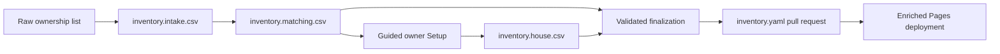

# Initial collection setup

This guide converts an informal ownership list into the canonical library without silently
accepting uncertain identities or overwriting reviewed data. Each stage produces an open,
human-readable record that can be inspected before the next stage.



## Prerequisites

- Node.js 24 LTS and the repository dependencies installed with `npm install` or `npm ci`.
- An approved noncommercial BGG application token for live matching and production enrichment.
- The repository Actions secret `BGG_API_TOKEN` configured before deploying a non-empty BGG-linked
  catalog.
- The [Setup service](SETUP_SERVICE.md) deployed when the owner will use the browser questionnaire.

## 1. Preserve the submitted wording

The resolved source list lives in `data/inventory.intake.csv`. It records the submitted wording,
normalized title, ownership detail, parent relationship, notes, and source links. Keep this separate
from canonical inventory so ambiguous products and expansions remain visible during review.

## 2. Build and review the matching manifest

Generate the deterministic manifest without network access:

```sh
npm run inventory:prepare
```

This writes `data/inventory.matching.csv`, assigns stable slugs and parent slugs, extracts IDs only
from direct BGG item links, preserves local-only sources, and flags shared IDs for review. Confirm
quantity, expansion relationships, and whether each expansion is independently playable.

Generate live candidate suggestions without modifying either source file:

```sh
BGG_API_TOKEN=... npm run inventory:match
```

The report at `outputs/inventory-match-report.csv` ranks exact and near matches. It never accepts a
candidate automatically. Copy only reviewed decisions back into the matching manifest.

Current migration notes belong in the manifest rather than application code. For example, Buzzed
Tower remains local-only, while Unsettled planet modules that lack separate BGG entries use their
publisher source and inherit Framework metadata.

## 3. Prepare guided owner answers

After changing the matching manifest, regenerate the questionnaire source:

```sh
npm run inventory:prepare-house
npm run house-editor:build
```

The first command creates `data/inventory.house.csv` with one row per selectable game. The second
validates it and writes an ignored inspection artifact to `outputs/house-intake.json`.

The public Setup screen remains locked until the separate service verifies a repository
collaborator. Once verified, the owner can answer games alphabetically, leave uncertain optional
ratings blank, and return later because progress is saved automatically in that browser. Completed
answers are submitted to a branch and pull request; Setup never writes to `main` or merges.

The live service ties the questionnaire to the Git blob SHA it read from `main` and rejects a stale
submission. Adding or removing questionnaire rows therefore requires regenerating and reloading the
current source rather than submitting an older browser copy.

## 4. Review inferred and local metadata

Game Night Library infers competitive, cooperative, team, and solo support from BGG mechanics and
player counts. BGG does not supply those exact mode labels. Leave an authored mode list empty when
the inference is correct; a non-empty list is a complete house override.

Games without a BGG ID must provide:

- a stable slug and public publisher or product source;
- local minimum and maximum players;
- local minimum and maximum duration;
- local minimum age;
- supported modes.

Non-standalone expansions inherit their base game's eligibility context. A local expansion that is
playable by itself should be modeled as a selectable base game unless it has enough independent
metadata to create a valid standalone play mode.

## 5. Validate and finalize

First validate the complete conversion without writing:

```sh
npm run inventory:finalize:check
```

Inspect the exact deterministic YAML:

```sh
npm run inventory:finalize:preview
```

Only after reviewing both inputs and the preview, replace the canonical inventory explicitly:

```sh
npm run inventory:finalize
npm run inventory:validate
```

Finalization rejects unresolved or duplicate identities, mismatched Setup rows, invalid parent
relationships, incomplete local metadata, invalid enumerations, and impossible ranges. The write is
validation-first and atomic: a failure leaves `data/inventory.yaml` untouched.

## Alternative bulk CSV import

For a collection that is already clean and fully described, copy `data/inventory.example.csv`, fill
it in, and run:

```sh
npm run inventory:import -- path/to/inventory.csv
```

Multi-value cells use semicolons. Expansion rows use `kind=expansion` and identify an imported base
through `parent_slug` (preferred) or `parent_bgg_id`. A row without `bgg_id` must include a public
`source_url` and every player, duration, and age override required for filtering.

## 6. Review and deploy

Commit the matching and house records together with the finalized inventory in a pull request. Run
the validation suite described in [Development](DEVELOPMENT.md), review the generated YAML diff, and
merge manually. The next Pages workflow enriches the catalog, caches cover thumbnails into the
ephemeral artifact, and deploys only if the complete build succeeds.

Once every required house row is complete, the next build hides the Setup tab. Adding a new
incomplete game later makes Setup available again.
