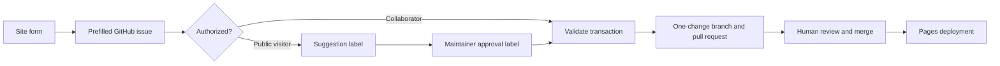

# Maintaining the library

Routine changes should begin on the public site whenever possible. The interface asks for the
relevant details and prepares the GitHub request; GitHub provides authentication, the public audit
trail, and the pull-request review boundary.

## Choose the right path

| Change                          | Recommended path                     |
| ------------------------------- | ------------------------------------ |
| Suggest an unowned game         | **Wish list → Request a game**       |
| Add one owned game              | **Manage → Add a game**              |
| Correct one owned game          | Open its card, then **Suggest edit** |
| Remove one owned game           | **Manage → Remove a game**           |
| Complete house-specific answers | Verified **Setup** questionnaire     |
| Import or reorganize many items | Reviewed CSV/YAML pull request       |

Visitors do not need repository knowledge to prepare a request. GitHub authentication is required
only when the final public issue is submitted or collaborator access is verified.

## Issue-to-pull-request workflow



Owner and collaborator requests are eligible for automation immediately. Public requests receive a
suggestion label and cannot mutate inventory until a maintainer applies
`approved-inventory-change`. Automation rejects duplicates, missing targets, malformed values,
invalid expansion relationships, and stale or conflicting requests with an explanatory comment.

Each automation branch applies exactly one transaction against current `main`. It opens a
non-draft pull request and dispatches validation against that exact head commit. Workflows never
approve or merge the request.

## Canonical ownership data

`data/inventory.yaml` contains base games with owned expansions nested beneath them. Keep published
slugs stable, use a BGG ID only once, and keep quantity and edition details faithful to the physical
copy.

House values describe this collection rather than the general game:

- availability and learned state;
- shelf label;
- house rating;
- setup and teaching burden;
- table space, interaction, luck, and downtime;
- moods, accessibility flags, content flags, and recommendation notes;
- optional player, duration, age, or mode overrides.

Prefer an override only when the owned edition or local experience materially differs from BGG
metadata. The UI shows both BGG and house values and identifies which one controls eligibility.

## Expansions and modular collections

Nest expansions beneath their base game even when an expansion can be played independently.
Standalone-capable expansions produce a labeled selectable play mode. Non-standalone expansions
modify their base game's capabilities without creating a separate catalog card.

Model modular collections as one base entry with nested owned content when players choose from a
shared system rather than treating every box as an unrelated game. Keep compatibility or edition
notes on the relevant expansion.

## Wish list lifecycle

Unowned games live in `data/wishlist.yaml` with a stable slug, BGG ID or public source URL, status
(`interested`, `researching`, or `planned`), and optional priority and notes.

When a wish-list game is purchased:

1. add the owned item to `data/inventory.yaml` with its physical and house state;
2. remove the matching entry from `data/wishlist.yaml` in the same pull request;
3. add an incomplete house row when the owner still needs to answer Setup questions.

Validation rejects a wish-list identity that is already owned. Until the move is merged, the game
stays out of Library filters and Roulette.

## Bulk and direct edits

Use direct YAML or the deterministic CSV importer when one pull request intentionally changes many
related records. Validate locally with:

```sh
npm run inventory:validate
npm run check
npm run test:e2e
```

Generated BGG metadata, cached covers, reports, and build output do not belong in commits. Pull
requests should contain authored source records and fixtures only.

## Public-data rule

Every value in the repository and deployed catalog is public. Shelf locations must be labels such
as `Basement A3`, never addresses, contact details, access instructions, or other sensitive
information.
